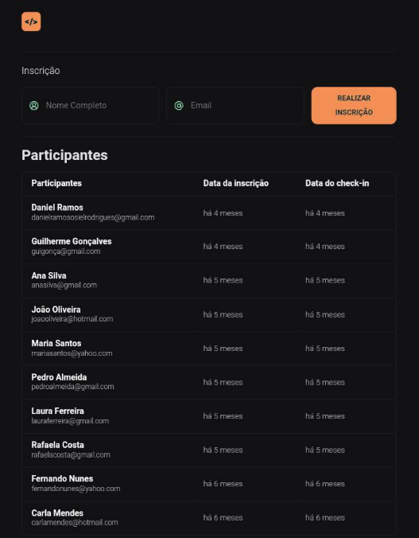

# Projeto - NLW Unite (Rocketseat)

## Imagem do Site (GitHub Pages)

## Anotações de Estudo

### HTML

  *Formato svg*

      - O svg é um formato muito bom para manter a qualidade de logos

  *Tag table*
    
    - A tag thead é uma parte head específica da tag table
    - A tag tbody é uma parte body específica da tag table

    A maior parte das tags do html possuem subpartes na tag table 

      - Exemplo: body, head, foot, div, section, etc

  *Tag Form*

    - Onsubmit permite o uso de uma função específica pelo formulário

### JavaScript

  *O que é?*

    Const é uma instrução para criação de variável constante

    Variáveis permitem a organização de dados

    Funções são minicomandos

    Flechas (=> que é o sinal de atribuição + maior que) permitem a conexão entre duas partes
      
      - As flechas com arrays são chamadas de arrow function

    A indexação de funções é feita por chaves {}

    Um objeto é algo que possui certa funcionalidade e/ou propriedades

      - Todo objeto é seguido por chaves {}

    return retorna algo que o bloco pede, seja ele uma função, number, variável, etc

      - Pode ser usado como parte de uma função

    newDate() é uma função que permite um armazenamento de números de forma lógica com datas e horas separadas por vírgulas

      - Cada uma das separações vai de 0 até um número determinado (mês de 0 a 11 | enquanto 0 é fevereiro, 11 é dezembro)

    Estrutura de Dados se refere à um conjunto de variáveis, funções e | diferentes dados em um mesmo encadeamento (arrays, conjuntos, etc)
    
    Arrays são vetores que armazenam dados
      - São criados por meio de colchetes []
    
    Estrutura de repetição é um loop/laço para
      
      - Sua sintaxe é: for(var nome of outronome) {}
        - Os parênteses devem possuir a condição e as variáveis/funções
        - As chaves {} devem possuir a ação/então
    
  *Interessantes e Recursos*
    
    Na criação de funções, sempre há o nome da função seguido de seu argumento, que estão entre parênteses ()
      
      - Até mesmo quando há o chamado da função e suas atribuições
      - É como se os parênteses fossem parte de seu nome
      
    As strings precisam vir entre crases ´...´ quando em multilinhas ou usar outros recursos junto com o '' ou "" (como o "...//n + ...")
    
    O recurso de ${} permite a alteração de um valor do código quando referente à uma função, variável ou propriedade já criada
      - Precisa de especificação (seletor.seletor)
        - A especificação é semelhante à especificação do CSS
        - A separação de seletor pai para seletor filho é feito por .
      - Chamado de Interpolação de templates 
    Cada vetor/array é chamado de posição (sendo elas de 0 a N)

  *O JS no HTML*

  Document permite a alteração de valores diretos no documento HTML
    
    - Ele é um objeto do JavaScript
    - A funcionalidade (que é incrementada com o . e o seu nome) querySelector() permite pesquisar certas partes do HTML de acordo com seu seletor (id, classes, nomes de tag, etc) e colocar no JS
    innerHTML permite a especificação de onde vai tirar (HTML, no caso) e atribuir um novo valor

  *Análise futura de códigos recortados*
  
  #Códigos e Sintaxes
    
    *Funções iniciais para cada perticipante*
    
    let participantes[
    const participante = {
      nome: "Daniel Ramos", //Alteração minha; alterar de acordo com a aula 1
      email: "danielramososielrodrigues@gmail.com",
      dataInscricao: new Date(2024, 2, 28, 20, 30),
      dataCheckIn: new Date(2024, 2, 31, 15, 00)
      },
      {
    nome: "Guilherme Gonçalves",
    email: "guigonça@gmail.com",
    dataInscricao: new Date(2024, 2, 24, 15, 45),
    dataCheckIn: new Date(2024, 2, 24, 16, 00)
      },
      ...
    ]
    
    ``Criado com chatGPT ^``

  *Estrutura de repetição JS*

for(let participante of participantes) {
  Faça algo
  Enquanto houver objetos / itens
}

  *Descrições decrescentes*
  "const dadosFormulario = new FormData(event.target)" => Target é o alvo do evento encontrado. Nesse caso, o alvo de event é o formulário;
  
  

### CSS (Cascading Style Sheets)
  
  *Descrições decrescentes*
  
    - "*" => (Seletor universal) Permite a alteração de elementos ocultos gerais;

    - "box-sizing: border-box;" => Permite o reset de toda a borda até antes do conteúdo (borda-caixa | borda-a-borda) Permite a união da borda e das caixas de conteúdo;
    
    - ":root" => Root é a raiz, onde configura todo o documento;
    
    - "--var" => variável;
    
    - "all: unset" => Remove o default do input;
    
    - "border: var(--border)" => Acrescenta a variável --border;
    
    - "fieldset > div" => seleciona apenas a primeira div (primeiro nível de div/div pai) do seletor fieldset;
    
    - "width: fit-content"=> Flexiona no conteúdo;
    
    - "border-collapse: collapse" => Espaço entre as bordas. Por padrão, ele está em separase, quando 
    separa. No momento, ele está unido/junto;
    
    - font-weight: 600 => Torna a fonte mais fina ou grossa;

    
### Plugins externos

https://day.js.org/en/ - Para a programação de datas e tempo relativo
